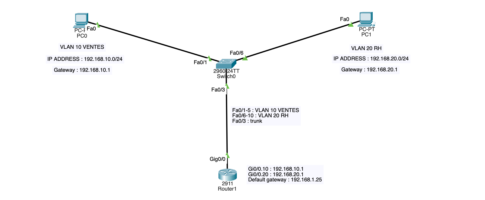
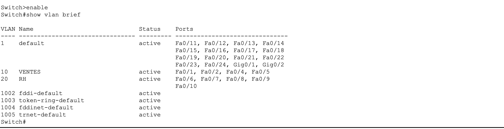
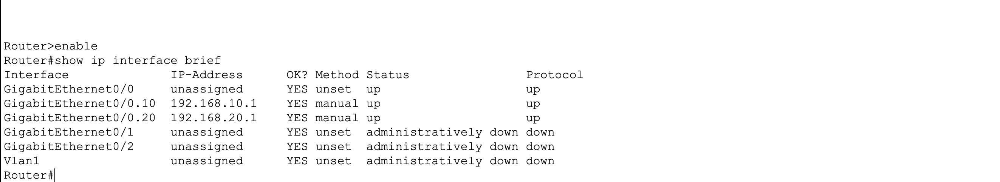
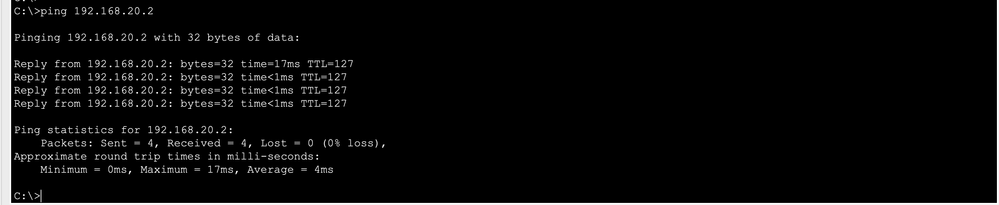

# Lab 2 — Inter-VLAN Routing — DataCorp (Router-on-a-Stick)

## 🎯 Contexte & Objectif

Dans ce lab, j'ai configuré l'infrastructure réseau de l'entreprise **DataCorp** pour le compte de NewTech Solutions. L'objectif était de segmenter le réseau en deux VLANs distincts — **VLAN 10 VENTES** et **VLAN 20 RH** — et de permettre la communication entre eux via un routeur, tout en configurant une route par défaut vers Internet.

**Ce lab couvre les compétences suivantes :**
- Création de VLANs et affectation de plages de ports avec `interface range`
- Configuration d'un lien trunk 802.1Q
- Routage inter-VLAN via Router-on-a-Stick
- Configuration d'une route par défaut vers Internet

## 🗺️ Topologie



## 📋 Plan d'adressage

| Équipement | Interface | IP | Masque | Gateway |
|---|---|---|---|---|
| PC0 | Fa0 | 192.168.10.2 | 255.255.255.0 | 192.168.10.1 |
| PC1 | Fa0 | 192.168.20.2 | 255.255.255.0 | 192.168.20.1 |
| Router1 | Gi0/0.10 | 192.168.10.1 | 255.255.255.0 | — |
| Router1 | Gi0/0.20 | 192.168.20.1 | 255.255.255.0 | — |
| Default route | — | 0.0.0.0/0 | — | 192.168.1.254 |
## 🆕 Nouveautés par rapport au Lab 1

| Nouveauté | Détail |
|---|---|
| `interface range` | Configure plusieurs ports en une seule commande |
| Route par défaut | `ip route 0.0.0.0 0.0.0.0 192.168.1.254` pour accéder à Internet |

## ✅ Étape 1 — Créer les VLANs

```bash
Switch>enable
Switch#config t

Switch(config)#vlan 10
Switch(config-vlan)#name VENTES
Switch(config-vlan)#exit

Switch(config)#vlan 20
Switch(config-vlan)#name RH
Switch(config-vlan)#exit
```

## ✅ Étape 2 — Affecter les ports (interface range)

```bash
Switch(config)#interface range fa0/1 - 5
Switch(config-if-range)#switchport mode access
Switch(config-if-range)#switchport access vlan 10
Switch(config-if-range)#exit

Switch(config)#interface range fa0/6 - 10
Switch(config-if-range)#switchport mode access
Switch(config-if-range)#switchport access vlan 20
Switch(config-if-range)#exit
Switch(config)#end
```

> 💡 `interface range fa0/1 - 5` configure les ports Fa0/1, Fa0/2, Fa0/3, Fa0/4 et Fa0/5 en une seule commande !



## ✅ Étape 3 — Configurer le trunk

```bash
Switch(config)#interface fa0/3
Switch(config-if)#switchport mode trunk
Switch(config-if)#switchport trunk allowed vlan 10,20
Switch(config-if)#end
```

## ✅ Étape 4 — Activer le routeur

```bash
Router(config)#interface gi0/0
Router(config-if)#no shutdown
Router(config-if)#end
```

## ✅ Étape 5 — Router-on-a-Stick

```bash
Router(config)#interface gi0/0.10
Router(config-subif)#encapsulation dot1q 10
Router(config-subif)#ip address 192.168.10.1 255.255.255.0
Router(config-subif)#exit

Router(config)#interface gi0/0.20
Router(config-subif)#encapsulation dot1q 20
Router(config-subif)#ip address 192.168.20.1 255.255.255.0
Router(config-subif)#end
```



## ✅ Étape 6 — Route par défaut

```bash
Router(config)#ip route 0.0.0.0 0.0.0.0 192.168.1.254
Router(config)#end
```

> 💡 `0.0.0.0 0.0.0.0` = toutes les destinations inconnues sont envoyées vers `192.168.1.254` (Internet).

## ✅ Étape 7 — IPs sur les PCs

**PC0 :** IP `192.168.10.2` — Masque `255.255.255.0` — Gateway `192.168.10.1`

**PC1 :** IP `192.168.20.2` — Masque `255.255.255.0` — Gateway `192.168.20.1`

## 🧪 Test final

```bash
ping 192.168.20.2
```


