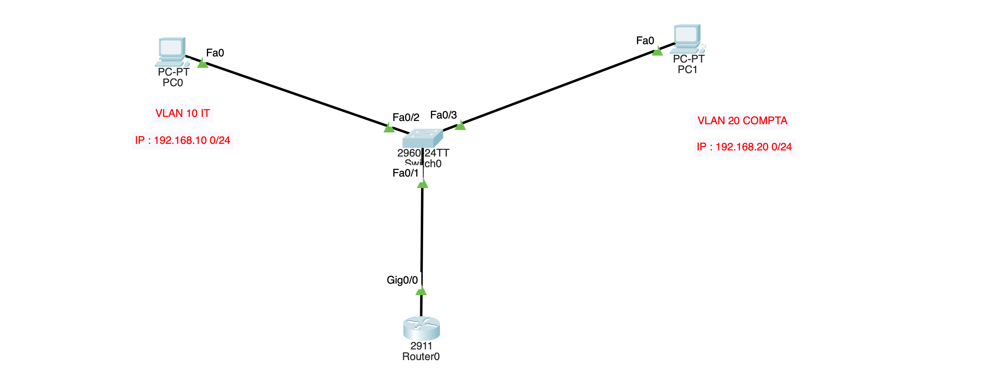
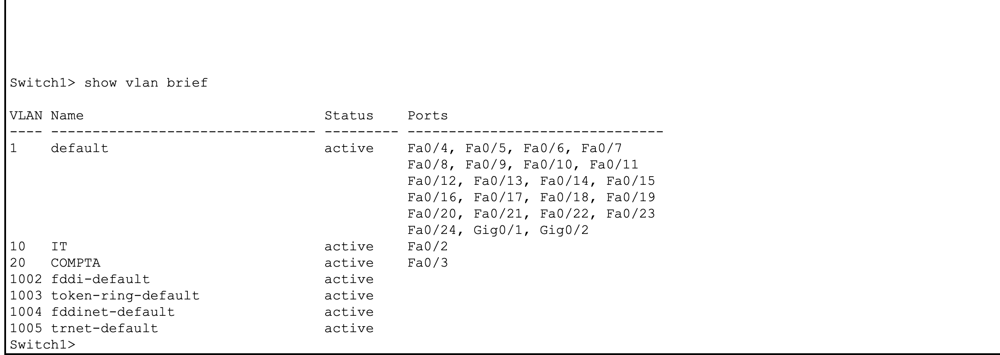
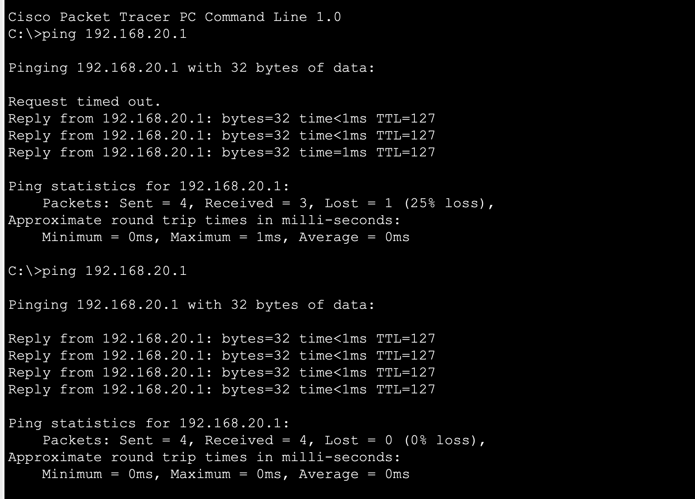

#  Lab — Inter-VLAN Routing (Router-on-a-Stick)

## 🎯 Contexte & Objectif

Dans ce lab, j'ai configuré un réseau d'entreprise composé de deux VLANs distincts — **VLAN 10 IT** et **VLAN 20 COMPTA** — sur un switch Cisco 2960 connecté à un routeur Cisco 2911.

L'objectif était de **segmenter le réseau** en isolant les deux départements dans des VLANs séparés, puis de les faire **communiquer entre eux** grâce à une technique appelée **Router-on-a-Stick**.

Sans cette configuration, PC0 et PC1 seraient invisibles l'un pour l'autre malgré le fait d'être sur le même switch physique. Grâce au trunk et aux sous-interfaces du routeur, les trames peuvent traverser les VLANs de manière contrôlée et sécurisée.

**Ce lab couvre les compétences suivantes :**
- Création et nommage de VLANs
- Affectation de ports en mode access
- Configuration d'un lien trunk 802.1Q
- Routage inter-VLAN via sous-interfaces (Router-on-a-Stick)
- Plan d'adressage IP et configuration des passerelles

## 🗺️ Topologie



## 📋 Plan d'adressage

| Équipement | Interface | IP | Masque | Passerelle |
|---|---|---|---|---|
| PC0 | Fa0 | 192.168.10.1 | 255.255.255.0 | 192.168.10.254 |
| PC1 | Fa0 | 192.168.20.1 | 255.255.255.0 | 192.168.20.254 |
| Router0 | Gi0/0.10 | 192.168.10.254 | 255.255.255.0 | — |
| Router0 | Gi0/0.20 | 192.168.20.254 | 255.255.255.0 | — |

## ✅ Étape 1 — Créer les VLANs

```bash
Switch>enable
Switch#config t
Switch(config)#vlan 10
Switch(config-vlan)#name IT
Switch(config-vlan)#exit
Switch(config)#vlan 20
Switch(config-vlan)#name COMPTA
Switch(config-vlan)#exit
```

> 💡 La commande `name` s'utilise uniquement en `config-vlan`, pas en `config` global.

## ✅ Étape 2 — Affecter les ports (mode access)

```bash
Switch(config)#interface fa0/2
Switch(config-if)#switchport mode access
Switch(config-if)#switchport access vlan 10
Switch(config-if)#exit
Switch(config)#interface fa0/3
Switch(config-if)#switchport mode access
Switch(config-if)#switchport access vlan 20
Switch(config-if)#exit
```

> 💡 Un port **access** = un seul VLAN = pour les équipements finaux (PC, imprimante...)



## ✅ Étape 3 — Configurer le trunk

```bash
Switch(config)#interface fa0/1
Switch(config-if)#switchport mode trunk
Switch(config-if)#switchport trunk allowed vlan 10,20
Switch(config-if)#end
```

> 💡 Un port **trunk** laisse passer plusieurs VLANs avec des tags **802.1Q**.

## ✅ Étape 4 — Activer l'interface du routeur

```bash
Router(config)#interface gi0/0
Router(config-if)#no shutdown
Router(config-if)#end
```

> ⚠️ Les interfaces des routeurs sont **éteintes par défaut** sur Packet Tracer !

## ✅ Étape 5 — Router-on-a-Stick

```bash
Router(config)#interface gi0/0.10
Router(config-subif)#encapsulation dot1q 10
Router(config-subif)#ip address 192.168.10.254 255.255.255.0
Router(config-subif)#exit
Router(config)#interface gi0/0.20
Router(config-subif)#encapsulation dot1q 20
Router(config-subif)#ip address 192.168.20.254 255.255.255.0
Router(config-subif)#end
```

## ✅ Étape 6 — IPs sur les PCs

**PC0 :** IP `192.168.10.1` — Masque `255.255.255.0` — Gateway `192.168.10.254`

**PC1 :** IP `192.168.20.1` — Masque `255.255.255.0` — Gateway `192.168.20.254`

## 🧪 Test final

```bash
ping 192.168.20.1
```


