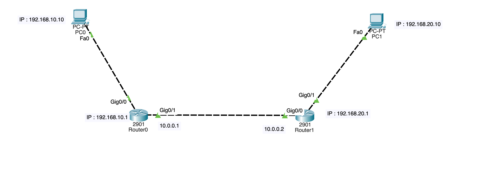
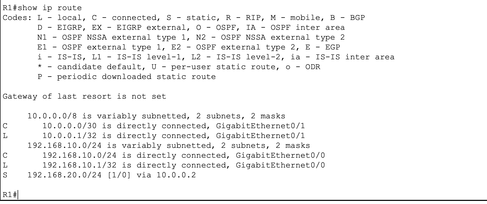
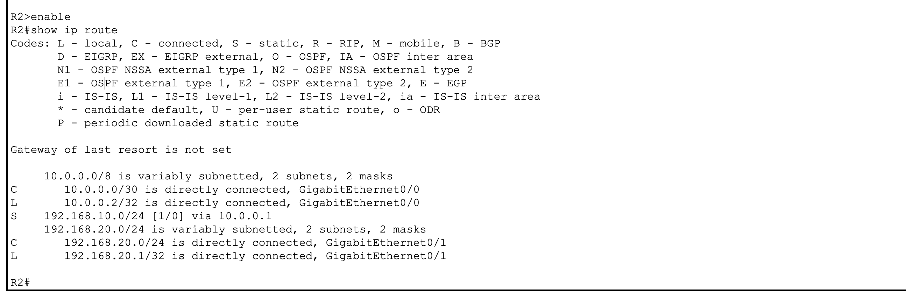
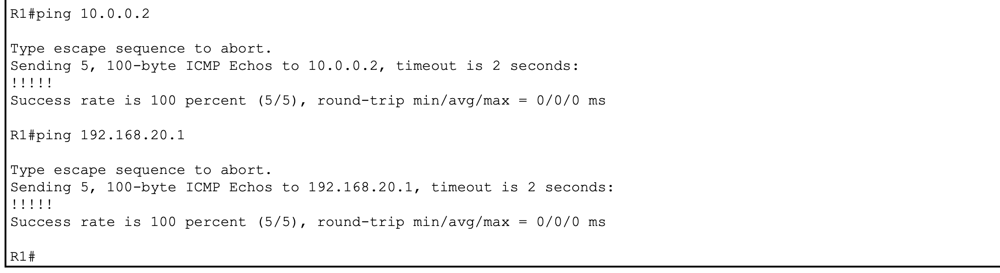
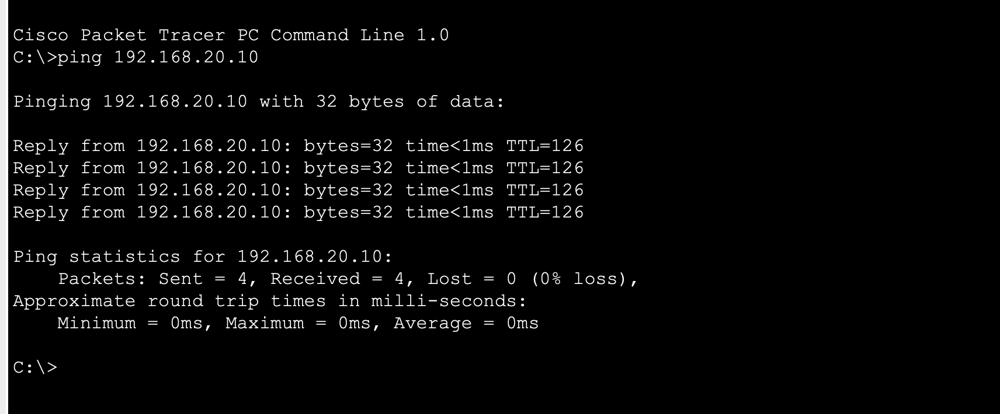
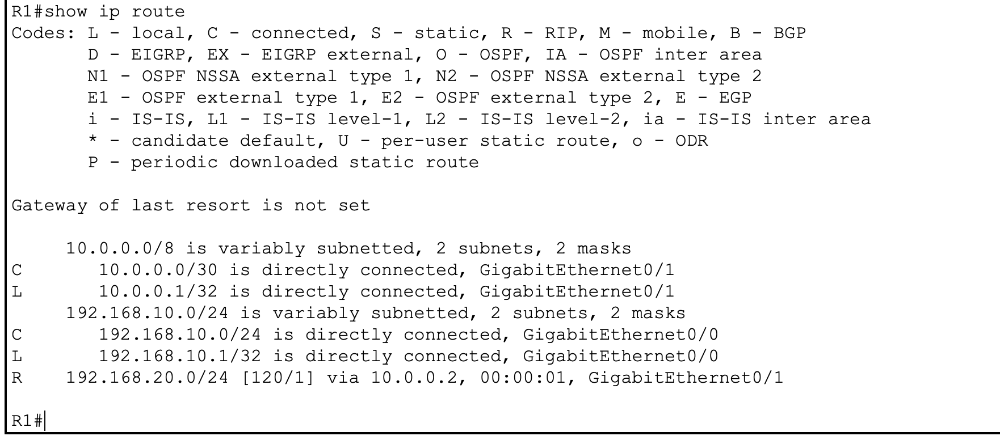
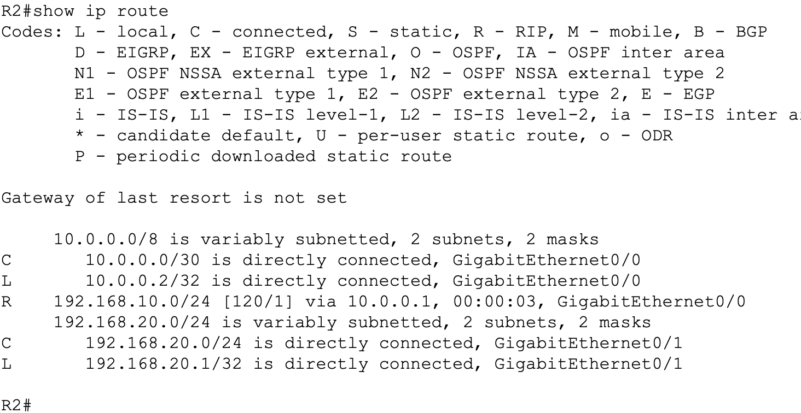

# Lab 3 — Routage Statique & RIP — Net Solutions

## 🎯 Contexte & Objectif

Dans ce lab, j'ai configuré la connectivité réseau entre deux sites distants de l'entreprise **Net Solutions**.  
L'objectif était de mettre en place le routage statique entre les deux sites, puis de migrer vers le routage dynamique avec **RIP v2**.

Ce lab couvre les compétences suivantes :

- Configuration des interfaces LAN et WAN sur des routeurs Cisco 2901
- Mise en place du routage statique avec `ip route`
- Migration vers le routage dynamique **RIP version 2**
- Vérification des tables de routage et tests de connectivité

---

## 🗺️ Topologie



| Site | Réseau | Routeur | Interface LAN | Interface WAN |
|------|--------|---------|---------------|---------------|
| Site A | 192.168.10.0/24 | Router0 (R1) | Gi0/0 | Gi0/1 |
| Site B | 192.168.20.0/24 | Router1 (R2) | Gi0/1 | Gi0/0 |
| Liaison WAN | 10.0.0.0/30 | R1 ↔ R2 | — | — |

---

## 📋 Plan d'adressage

| Équipement | Interface | IP | Masque | Passerelle |
|---|---|---|---|---|
| PC0 (Site A) | Fa0 | 192.168.10.10 | 255.255.255.0 | 192.168.10.1 |
| PC1 (Site B) | Fa0 | 192.168.20.10 | 255.255.255.0 | 192.168.20.1 |
| Router0 (R1) | Gi0/0 | 192.168.10.1 | 255.255.255.0 | — |
| Router0 (R1) | Gi0/1 | 10.0.0.1 | 255.255.255.252 | — |
| Router1 (R2) | Gi0/0 | 10.0.0.2 | 255.255.255.252 | — |
| Router1 (R2) | Gi0/1 | 192.168.20.1 | 255.255.255.0 | — |

---

## ✅ Étape 1 — Configuration des interfaces

Configuration des adresses IP sur chaque routeur via le CLI.

```bash
# Sur R1
interface GigabitEthernet0/0
 ip address 192.168.10.1 255.255.255.0
 no shutdown

interface GigabitEthernet0/1
 ip address 10.0.0.1 255.255.255.252
 no shutdown
```

```bash
# Sur R2
interface GigabitEthernet0/1
 ip address 192.168.20.1 255.255.255.0
 no shutdown

interface GigabitEthernet0/0
 ip address 10.0.0.2 255.255.255.252
 no shutdown
```

---

## ✅ Étape 2 — Routage statique

On indique à chaque routeur comment atteindre le réseau distant.

```bash
# Sur R1
ip route 192.168.20.0 255.255.255.0 10.0.0.2

# Sur R2
ip route 192.168.10.0 255.255.255.0 10.0.0.1
```

Vérification des tables de routage (entrées `S` = Static) :




Test de connectivité :




---

## ✅ Étape 3 — Migration vers RIP v2

Suppression des routes statiques puis activation de RIP sur les deux routeurs.

```bash
# Sur R1
no ip route 192.168.20.0 255.255.255.0 10.0.0.2

router rip
 version 2
 network 192.168.10.0
 network 10.0.0.0
```

```bash
# Sur R2
no ip route 192.168.10.0 255.255.255.0 10.0.0.1

router rip
 version 2
 network 192.168.20.0
 network 10.0.0.0
```

Vérification des tables de routage (entrées `R` = RIP) :




---

## ✅ Test final

Ping PC à PC après migration vers RIP :


---

*Lab réalisé dans le cadre de la formation TSSR — Studi*  
*Outil : Cisco Packet Tracer*
